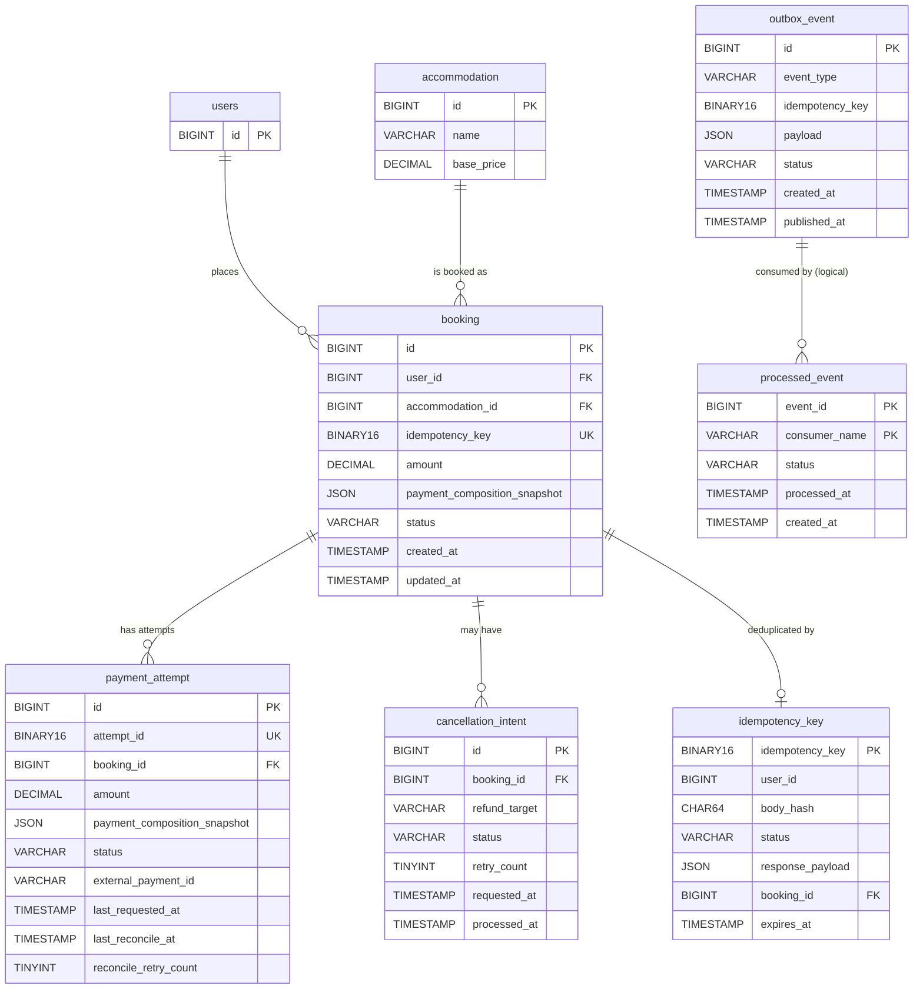
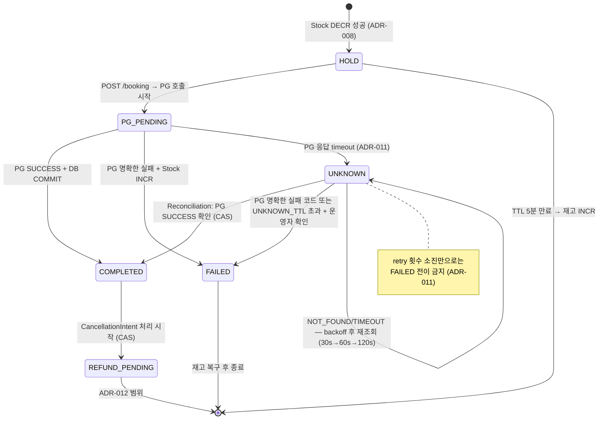
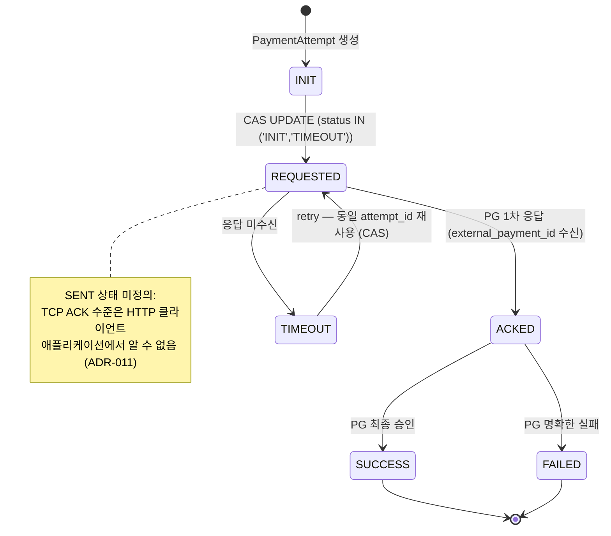
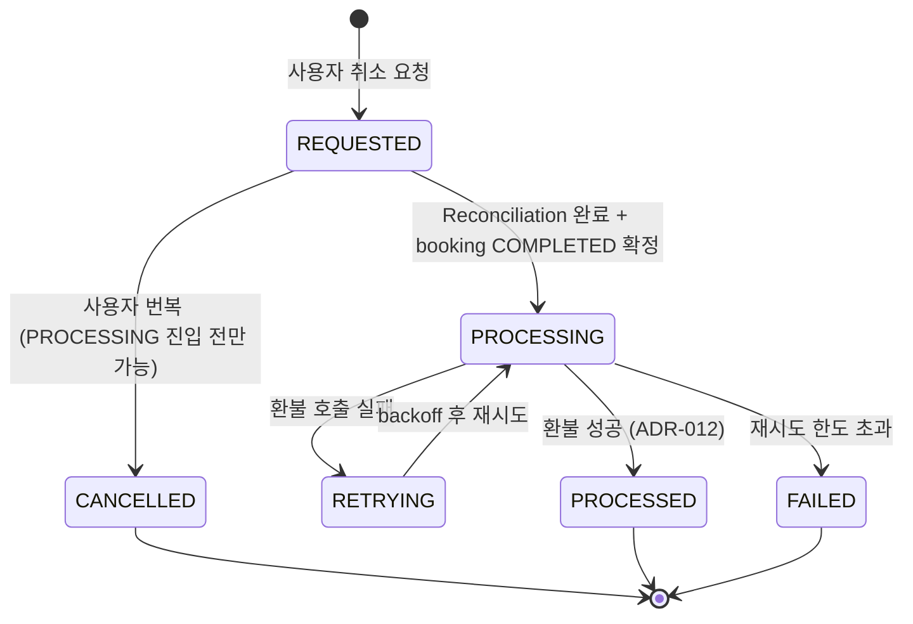
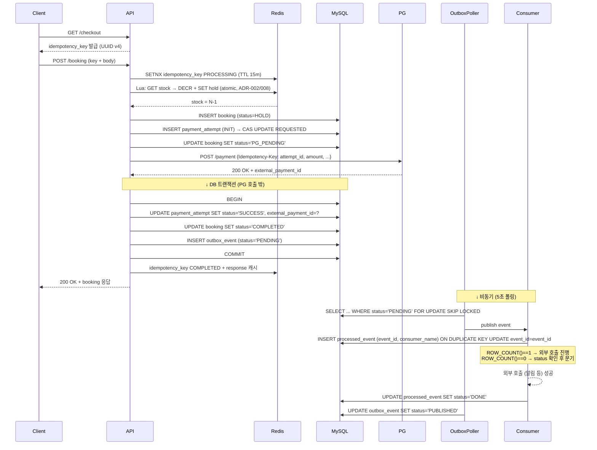
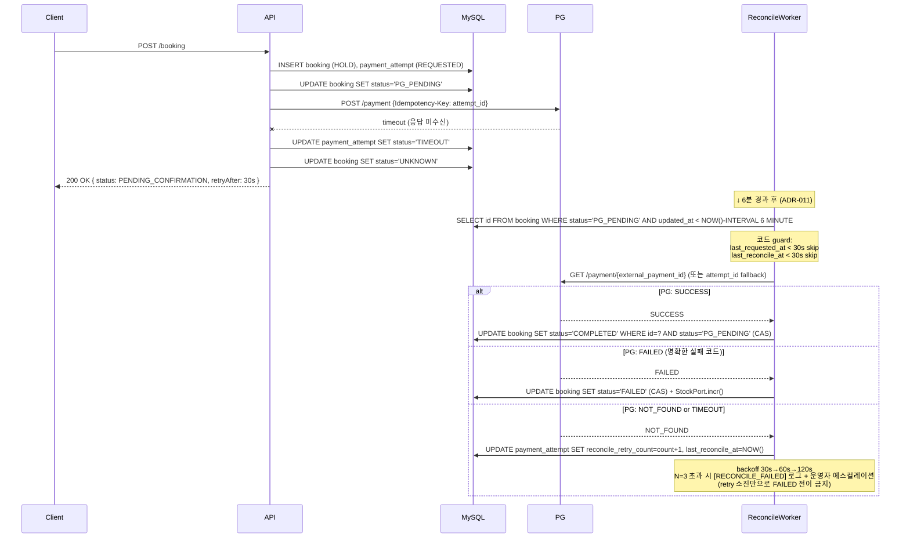
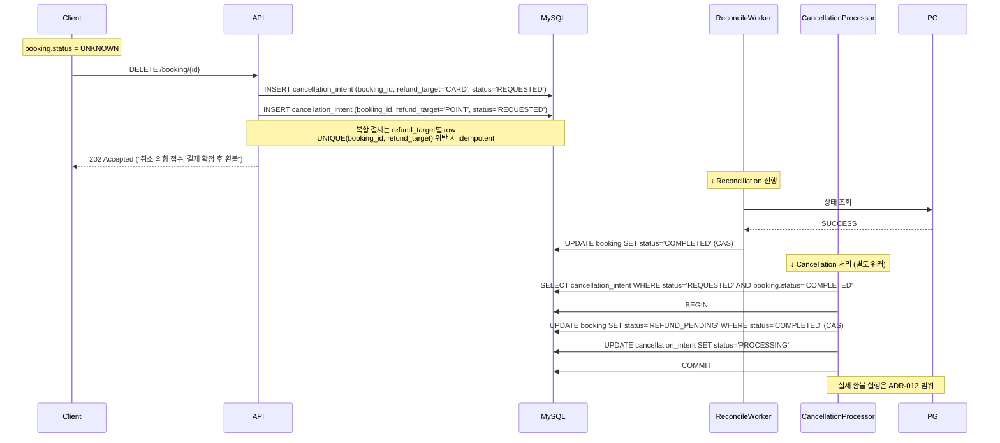
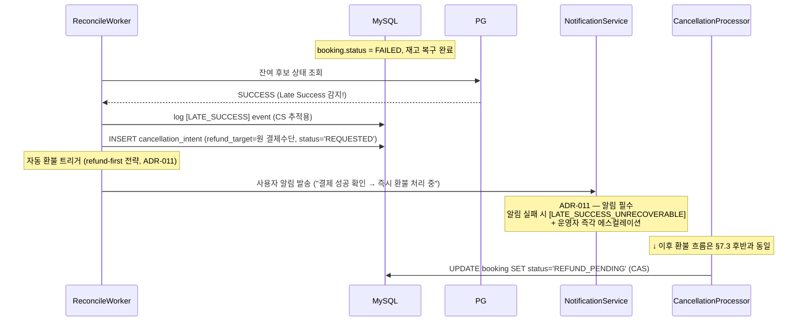
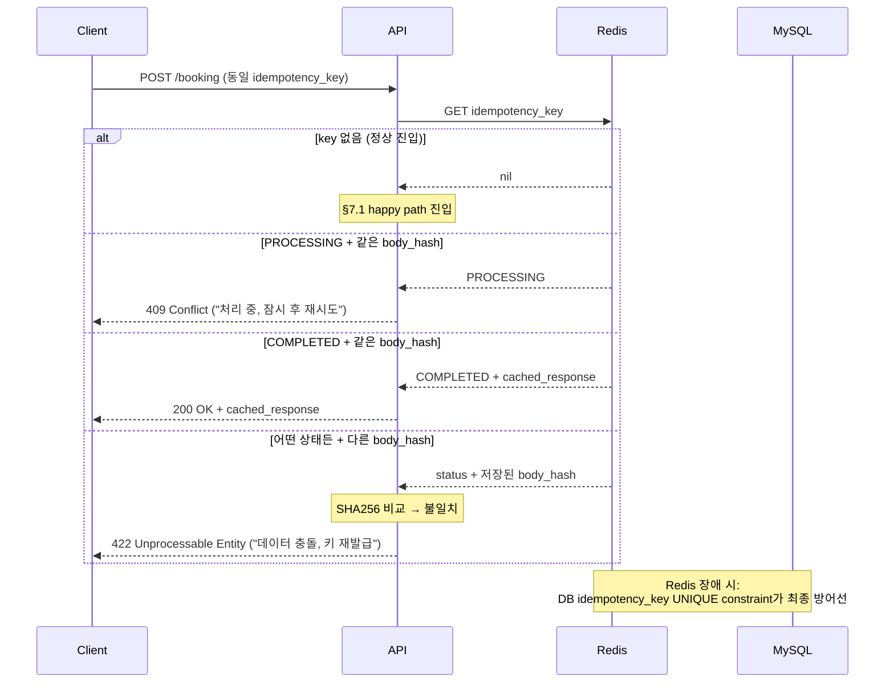

# ERD — 주문/결제 도메인 (booking system)

> ADR-006 / 008 / 009 / 010 / 011에 분산된 엔티티·상태·제약을 통합한 단일 도메인 모델 문서.
> 본 문서는 **MySQL 8.0+ (또는 MariaDB 10.6+)** 환경을 가정한다 (DECISIONS.md "결정의 한계 #3").

## 1. Status & Scope

- **Status**: Accepted (2026-05-03)
- **Scope**: 주문/결제 도메인의 영속 엔티티 7종 + 관계 + 상태 머신 + 핵심 흐름 + DDL.
- **Out of Scope** (다른 plan): 환불 실행 상세(ADR-012), Stock counter 내부(Redis), Rate Limit 상태(Redis), 인증/프로필(별도 도메인).

## 2. Domain Boundaries

### in-scope (7 엔티티)

| 엔티티 | 책임 ADR | 역할 |
|---|---|---|
| `booking` | ADR-008/011 | Aggregate Root — 예약 1건의 lifecycle (HOLD → COMPLETED/FAILED/UNKNOWN → REFUND_PENDING) |
| `payment_attempt` | ADR-011 | PG 멱등성 단위 — 한 booking 내 여러 시도 가능 (카드 변경, 재시도) |
| `cancellation_intent` | ADR-011 | 취소 의향 보존 — UNKNOWN 상태에서 즉시 취소 불가 시 defer |
| `outbox_event` | ADR-010 | PG-DB-이벤트 atomicity 보장 |
| `processed_event` | ADR-010 amendment | Consumer 단위 멱등 처리 (write-first + status 패턴) |
| `idempotency_key` | ADR-006 | API 레벨 중복 결제 방지 (DB 영속 계층) |
| `users`, `accommodation` | 참조용 최소 스펙 | FK 대상. 상세 컬럼은 별도 도메인 ERD에서 |

### out-of-scope

- `point_ledger` — 포인트 도메인. ADR-010에서 Consumer 예시로 언급됐으나 본 ERD 범위 밖. 이름·키 시그니처만 후속에서 정의.
- ShedLock 테이블 — 라이브러리(`net.javacrumbs.shedlock`) 표준 스키마(`name`/`lock_until`/`locked_at`/`locked_by`) 그대로 사용. 본 ERD에 컬럼 상세 미기재.
- `event_log`/Read Model — 단일 타임라인 뷰. 본 ERD에서 **만들지 않음**으로 명시 결정 (ADR-011 §고려사항 닫음). 근거: Booking + PaymentAttempt + CancellationIntent의 `created_at`/`updated_at`만으로 CS 추적 충분. CS·감사 요구가 임계치 넘을 때 별도 ADR.

## 3. Entity Overview

| 엔티티 | PK | UNIQUE | 핵심 인덱스 | 평균 row 수명 |
|---|---|---|---|---|
| `booking` | `id` BIGINT | `idempotency_key` | `(status, updated_at)`, `(user_id)` | 영속 |
| `payment_attempt` | `id` BIGINT | `attempt_id` | `(booking_id)`, `(status, updated_at)`, `(external_payment_id)` | 영속 |
| `cancellation_intent` | `id` BIGINT | `(booking_id, refund_target)` | `(status)` | 영속 |
| `outbox_event` | `id` BIGINT | — | `(status, created_at)` | archive 후 삭제 |
| `processed_event` | `(event_id, consumer_name)` 복합 | (PK 자체) | `(created_at)` | 24h~7d retention |
| `idempotency_key` | `idempotency_key` BINARY(16) | (PK 자체) | `(expires_at)` | 15분 TTL + 정리 배치 |
| `users` | `id` BIGINT | — | — | 영속 |
| `accommodation` | `id` BIGINT | — | — | 영속 |

## 4. Entity Specifications

### 4.1 `booking` — Aggregate Root

예약 1건의 전체 생명주기. ADR-008(상태 진입)과 ADR-011(UNKNOWN/REFUND_PENDING 확장)을 통합.

| 컬럼 | 타입 | 제약 | 설명 |
|---|---|---|---|
| `id` | `BIGINT UNSIGNED` | PK, AUTO_INCREMENT | surrogate key |
| `user_id` | `BIGINT UNSIGNED` | NOT NULL, FK→`users(id)` | 결제 주체 |
| `accommodation_id` | `BIGINT UNSIGNED` | NOT NULL, FK→`accommodation(id)` | 결제 대상 |
| `idempotency_key` | `BINARY(16)` | NOT NULL, UNIQUE | ADR-006 — 클라이언트 발급 UUID v4. DB 영속 방어선 |
| `amount` | `DECIMAL(15, 2)` | NOT NULL | 결제 총액 |
| `payment_composition_snapshot` | `JSON` | NOT NULL | ADR-009 — `PaymentComposition` 직렬화. 결제 수단 구성·금액·포인트 포함 |
| `status` | `VARCHAR(20)` | NOT NULL | `HOLD` / `PG_PENDING` / `COMPLETED` / `FAILED` / `UNKNOWN` / `REFUND_PENDING` |
| `created_at` | `TIMESTAMP` | NOT NULL DEFAULT CURRENT_TIMESTAMP | UTC 가정 |
| `updated_at` | `TIMESTAMP` | NOT NULL DEFAULT CURRENT_TIMESTAMP ON UPDATE CURRENT_TIMESTAMP | ADR-011 Reconciliation 트리거 (`updated_at < now() - 6분`) |

**상태 의미** (자세한 전이는 §6.1):
- `HOLD`: 재고 진입 직후, 결제 시작 전 (ADR-008 5분 TTL)
- `PG_PENDING`: PG 호출 중, 응답 대기
- `COMPLETED`: 결제 성공 + 예약 확정
- `FAILED`: 결제 실패 + 재고 복구 완료
- `UNKNOWN`: PG 응답 미수신 (ADR-011) — 우리 시스템 관점, PG 상태 아님
- `REFUND_PENDING`: 환불 시작 (ADR-011) → 이후 ADR-012 범위

**JSON 스냅샷 구조 예시** (`payment_composition_snapshot`):
```json
{
  "methods": [
    {"type": "CARD", "amount": "45000.00"},
    {"type": "POINT", "amount": "5000.00"}
  ],
  "total": "50000.00"
}
```

### 4.2 `payment_attempt` — PG 멱등성 단위 (ADR-011)

booking 1건에 여러 attempt가 있을 수 있다. 카드 변경·금액 변경은 **새 attempt**, retry는 **같은 attempt 재사용**.

| 컬럼 | 타입 | 제약 | 설명 |
|---|---|---|---|
| `id` | `BIGINT UNSIGNED` | PK, AUTO_INCREMENT | surrogate |
| `attempt_id` | `BINARY(16)` | NOT NULL, UNIQUE | UUID. **PG 멱등성 헤더**로 전달 |
| `booking_id` | `BIGINT UNSIGNED` | NOT NULL, FK→`booking(id)` | |
| `amount` | `DECIMAL(15, 2)` | NOT NULL | **불변** — attempt 생성 시 확정 |
| `payment_composition_snapshot` | `JSON` | NOT NULL | **불변** — payload 일치 검증용 (ADR-011 "payload 불변 원칙") |
| `status` | `VARCHAR(20)` | NOT NULL | `INIT` / `REQUESTED` / `ACKED` / `SUCCESS` / `FAILED` / `TIMEOUT` |
| `external_payment_id` | `VARCHAR(100)` | NULL | PG 응답에서 받음 (ACKED 이후 저장). PG 상태 조회 1차 키 |
| `last_requested_at` | `TIMESTAMP` | NULL | ADR-011 Reconciliation **in-flight 보호** (`< 30s` skip) |
| `last_reconcile_at` | `TIMESTAMP` | NULL | ADR-011 **중복 reconciliation 방지** (`< 30s` skip) |
| `reconcile_retry_count` | `TINYINT UNSIGNED` | NOT NULL DEFAULT 0 | ADR-011 — N=3 한계. 초과 시 `[RECONCILE_FAILED]` 로그 + 운영자 에스컬레이션 |
| `created_at` | `TIMESTAMP` | NOT NULL DEFAULT CURRENT_TIMESTAMP | |
| `updated_at` | `TIMESTAMP` | NOT NULL DEFAULT CURRENT_TIMESTAMP ON UPDATE CURRENT_TIMESTAMP | |

**retry 진입 CAS** (ADR-011):
```sql
UPDATE payment_attempt
SET status = 'REQUESTED', last_requested_at = NOW()
WHERE id = ? AND status IN ('INIT', 'TIMEOUT');
-- ROW_COUNT() == 0이면 이미 진행 중 → skip
```

### 4.3 `cancellation_intent` — 취소 의향 (ADR-011)

UNKNOWN 상태에서 즉시 취소는 "청구됨 + 취소됨" 위험. 의향만 저장 후 reconciliation 완료 후 실행.

| 컬럼 | 타입 | 제약 | 설명 |
|---|---|---|---|
| `id` | `BIGINT UNSIGNED` | PK, AUTO_INCREMENT | |
| `booking_id` | `BIGINT UNSIGNED` | NOT NULL, FK→`booking(id)` | |
| `refund_target` | `VARCHAR(20)` | NOT NULL | `CARD` / `YPAY` / `POINT` 등 환불 대상 종류. 복합 결제는 row 여러 개 |
| `status` | `VARCHAR(20)` | NOT NULL | `REQUESTED` / `CANCELLED` / `PROCESSING` / `RETRYING` / `PROCESSED` / `FAILED` |
| `retry_count` | `TINYINT UNSIGNED` | NOT NULL DEFAULT 0 | RETRYING 사이클 카운터 |
| `requested_at` | `TIMESTAMP` | NOT NULL DEFAULT CURRENT_TIMESTAMP | 사용자 요청 시각 |
| `processed_at` | `TIMESTAMP` | NULL | 환불 완료 시각 |
| `created_at` | `TIMESTAMP` | NOT NULL DEFAULT CURRENT_TIMESTAMP | |
| `updated_at` | `TIMESTAMP` | NOT NULL DEFAULT CURRENT_TIMESTAMP ON UPDATE CURRENT_TIMESTAMP | |

**복합 결제 환불 idempotency**:
- `UNIQUE (booking_id, refund_target)` — ADR-011 명시. 같은 booking의 같은 결제수단 환불은 row 1개만 존재
- 카드+포인트 복합 결제 취소는 2 row (`refund_target='CARD'`, `refund_target='POINT'`)

### 4.4 `outbox_event` (ADR-010)

PG 호출 + DB 커밋 + 이벤트 발행의 atomicity 보장. Booking과 같은 트랜잭션에 INSERT.

| 컬럼 | 타입 | 제약 | 설명 |
|---|---|---|---|
| `id` | `BIGINT UNSIGNED` | PK, AUTO_INCREMENT | |
| `event_type` | `VARCHAR(50)` | NOT NULL | `BookingCompleted`, `BookingFailed` 등 |
| `idempotency_key` | `BINARY(16)` | NOT NULL | ADR-010 — ADR-006 키 그대로 통합. 컨슈머 멱등 처리용 |
| `payload` | `JSON` | NOT NULL | 이벤트 payload (booking_id, amount, paymentMethod 등) |
| `status` | `VARCHAR(20)` | NOT NULL | `PENDING` / `PUBLISHED` |
| `created_at` | `TIMESTAMP` | NOT NULL DEFAULT CURRENT_TIMESTAMP | |
| `published_at` | `TIMESTAMP` | NULL | 발행 시각 (성공 후 set) |

**폴러 쿼리** (ADR-010, MySQL 8.0+):
```sql
SELECT id, event_type, payload
FROM outbox_event
WHERE status = 'PENDING'
ORDER BY created_at
LIMIT 100
FOR UPDATE SKIP LOCKED;
```

### 4.5 `processed_event` — Consumer Idempotency (ADR-010 amendment)

ADR-010 amendment의 **write-first + status** 패턴 구현체. consumer 단위 독립.

| 컬럼 | 타입 | 제약 | 설명 |
|---|---|---|---|
| `event_id` | `BIGINT UNSIGNED` | PK part 1 (composite) | `outbox_event.id` 참조 (FK 미선언 — 약결합) |
| `consumer_name` | `VARCHAR(50)` | PK part 2 | "NotificationHandler", "PointLedgerHandler" 등 |
| `status` | `VARCHAR(20)` | NOT NULL | `INIT` (외부 호출 전) / `DONE` (외부 호출 성공) |
| `processed_at` | `TIMESTAMP` | NULL | DONE 전이 시각 |
| `created_at` | `TIMESTAMP` | NOT NULL DEFAULT CURRENT_TIMESTAMP | retention 기준 (24h ~ 7d) |

**컨슈머 패턴** (ADR-010 amendment 규칙 2):
```sql
INSERT INTO processed_event (event_id, consumer_name, status)
VALUES (?, ?, 'INIT')
ON DUPLICATE KEY UPDATE event_id = event_id;
-- ROW_COUNT() == 1: 신규 INSERT → 외부 호출 진행
-- ROW_COUNT() == 0: 기존 row 존재 → status 확인 후 분기
```

**FK 약결합 근거**: `outbox_event`는 archive 후 삭제, `processed_event`는 짧은 retention. cascade 부담 회피 + 두 테이블 간 lifecycle 차이가 커서 물리 FK 비효율.

### 4.6 `idempotency_key` — API 멱등성 DB 계층 (ADR-006)

Redis 1차 + DB 2차 이중 계층의 영속 부분. Redis 장애 시에도 이중 결제 차단.

| 컬럼 | 타입 | 제약 | 설명 |
|---|---|---|---|
| `idempotency_key` | `BINARY(16)` | PK | ADR-006 — 클라이언트 UUID v4 |
| `user_id` | `BIGINT UNSIGNED` | NOT NULL | 발행 주체 |
| `body_hash` | `CHAR(64)` | NOT NULL | SHA256 hex (userId+productId+amount+paymentMethod+points) |
| `status` | `VARCHAR(20)` | NOT NULL | `PROCESSING` / `COMPLETED` |
| `response_payload` | `JSON` | NULL | 200 OK 캐시 응답 (COMPLETED 이후 set) |
| `booking_id` | `BIGINT UNSIGNED` | NULL, FK→`booking(id)` | 완료 후 조인용 (booking 생성 후 update) |
| `created_at` | `TIMESTAMP` | NOT NULL DEFAULT CURRENT_TIMESTAMP | |
| `expires_at` | `TIMESTAMP` | NOT NULL | 15분 TTL — 결제 TTL 5분 + 마진 10분 (ADR-006) |

**3-state 응답 분기** (자세한 시퀀스는 §7.5):
- 같은 키 + PROCESSING + 같은 body_hash → **409 Conflict**
- 같은 키 + COMPLETED + 같은 body_hash → **200 OK** (response_payload 반환)
- 같은 키 + 어떤 상태든 + 다른 body_hash → **422 Unprocessable Entity**

### 4.7 supporting — `users`, `accommodation`

본 ERD 범위 밖이지만 FK 대상이라 시그니처만 보장:

| 테이블 | PK | 본 ERD 가정 |
|---|---|---|
| `users` | `id` BIGINT UNSIGNED | 존재 + ID 시그니처. 인증/프로필은 별도 도메인 ERD |
| `accommodation` | `id` BIGINT UNSIGNED | 존재 + ID + `name` + `base_price`. 객실 타입·이미지 등은 상품 도메인 |

## 5. ERD Diagram



**FK 정책 메모**:
- `outbox_event ↔ processed_event`는 약결합 (FK 미선언). retention 차이로 cascade 부담 회피
- `idempotency_key.booking_id`는 단방향 FK. booking 생성 후 update — 양방향 FK는 시드 순서 문제로 회피

## 6. State Machines

### 6.1 Booking 상태 머신



### 6.2 PaymentAttempt 상태 머신



### 6.3 CancellationIntent 상태 머신



## 7. Sequence Diagrams

### 7.1 Happy Path — HOLD → COMPLETED



### 7.2 PG Timeout → UNKNOWN → Reconciliation



### 7.3 CancellationIntent — UNKNOWN 상태 취소



### 7.4 Late Success — FAILED 후 PG SUCCESS



### 7.5 Idempotent Retry — 200/409/422 분기 (ADR-006)



## 8. DDL Scripts (MySQL 8.0+)

```sql
-- ============================================================
-- supporting (FK 참조 대상 — 시그니처만)
-- ============================================================

CREATE TABLE users (
  id          BIGINT UNSIGNED NOT NULL AUTO_INCREMENT,
  created_at  TIMESTAMP NOT NULL DEFAULT CURRENT_TIMESTAMP,
  PRIMARY KEY (id)
) ENGINE=InnoDB DEFAULT CHARSET=utf8mb4 COLLATE=utf8mb4_0900_ai_ci;

CREATE TABLE accommodation (
  id          BIGINT UNSIGNED NOT NULL AUTO_INCREMENT,
  name        VARCHAR(200) NOT NULL,
  base_price  DECIMAL(15, 2) NOT NULL,
  created_at  TIMESTAMP NOT NULL DEFAULT CURRENT_TIMESTAMP,
  PRIMARY KEY (id)
) ENGINE=InnoDB DEFAULT CHARSET=utf8mb4 COLLATE=utf8mb4_0900_ai_ci;

-- ============================================================
-- booking (Aggregate Root)
-- ============================================================

CREATE TABLE booking (
  id                            BIGINT UNSIGNED NOT NULL AUTO_INCREMENT,
  user_id                       BIGINT UNSIGNED NOT NULL,
  accommodation_id              BIGINT UNSIGNED NOT NULL,
  idempotency_key               BINARY(16) NOT NULL,
  amount                        DECIMAL(15, 2) NOT NULL,
  payment_composition_snapshot  JSON NOT NULL,
  status                        VARCHAR(20) NOT NULL,
  created_at                    TIMESTAMP NOT NULL DEFAULT CURRENT_TIMESTAMP,
  updated_at                    TIMESTAMP NOT NULL DEFAULT CURRENT_TIMESTAMP ON UPDATE CURRENT_TIMESTAMP,
  PRIMARY KEY (id),
  UNIQUE KEY uk_booking_idempotency_key (idempotency_key),
  KEY idx_booking_status_updated (status, updated_at),
  KEY idx_booking_user (user_id),
  KEY idx_booking_accommodation (accommodation_id),
  CONSTRAINT fk_booking_user FOREIGN KEY (user_id) REFERENCES users(id),
  CONSTRAINT fk_booking_accommodation FOREIGN KEY (accommodation_id) REFERENCES accommodation(id)
) ENGINE=InnoDB DEFAULT CHARSET=utf8mb4 COLLATE=utf8mb4_0900_ai_ci;

-- ============================================================
-- payment_attempt (PG idempotency 단위, ADR-011)
-- ============================================================

CREATE TABLE payment_attempt (
  id                            BIGINT UNSIGNED NOT NULL AUTO_INCREMENT,
  attempt_id                    BINARY(16) NOT NULL,
  booking_id                    BIGINT UNSIGNED NOT NULL,
  amount                        DECIMAL(15, 2) NOT NULL,
  payment_composition_snapshot  JSON NOT NULL,
  status                        VARCHAR(20) NOT NULL,
  external_payment_id           VARCHAR(100) DEFAULT NULL,
  last_requested_at             TIMESTAMP NULL DEFAULT NULL,
  last_reconcile_at             TIMESTAMP NULL DEFAULT NULL,
  reconcile_retry_count         TINYINT UNSIGNED NOT NULL DEFAULT 0,
  created_at                    TIMESTAMP NOT NULL DEFAULT CURRENT_TIMESTAMP,
  updated_at                    TIMESTAMP NOT NULL DEFAULT CURRENT_TIMESTAMP ON UPDATE CURRENT_TIMESTAMP,
  PRIMARY KEY (id),
  UNIQUE KEY uk_pa_attempt_id (attempt_id),
  KEY idx_pa_booking (booking_id),
  KEY idx_pa_status_updated (status, updated_at),
  KEY idx_pa_external_payment (external_payment_id),
  CONSTRAINT fk_pa_booking FOREIGN KEY (booking_id) REFERENCES booking(id)
) ENGINE=InnoDB DEFAULT CHARSET=utf8mb4 COLLATE=utf8mb4_0900_ai_ci;

-- ============================================================
-- cancellation_intent (취소 의향, ADR-011)
-- ============================================================

CREATE TABLE cancellation_intent (
  id            BIGINT UNSIGNED NOT NULL AUTO_INCREMENT,
  booking_id    BIGINT UNSIGNED NOT NULL,
  refund_target VARCHAR(20) NOT NULL,
  status        VARCHAR(20) NOT NULL,
  retry_count   TINYINT UNSIGNED NOT NULL DEFAULT 0,
  requested_at  TIMESTAMP NOT NULL DEFAULT CURRENT_TIMESTAMP,
  processed_at  TIMESTAMP NULL DEFAULT NULL,
  created_at    TIMESTAMP NOT NULL DEFAULT CURRENT_TIMESTAMP,
  updated_at    TIMESTAMP NOT NULL DEFAULT CURRENT_TIMESTAMP ON UPDATE CURRENT_TIMESTAMP,
  PRIMARY KEY (id),
  UNIQUE KEY uk_ci_booking_target (booking_id, refund_target),
  KEY idx_ci_status (status),
  CONSTRAINT fk_ci_booking FOREIGN KEY (booking_id) REFERENCES booking(id)
) ENGINE=InnoDB DEFAULT CHARSET=utf8mb4 COLLATE=utf8mb4_0900_ai_ci;

-- ============================================================
-- outbox_event (ADR-010)
-- ============================================================

CREATE TABLE outbox_event (
  id              BIGINT UNSIGNED NOT NULL AUTO_INCREMENT,
  event_type      VARCHAR(50) NOT NULL,
  idempotency_key BINARY(16) NOT NULL,
  payload         JSON NOT NULL,
  status          VARCHAR(20) NOT NULL,
  created_at      TIMESTAMP NOT NULL DEFAULT CURRENT_TIMESTAMP,
  published_at    TIMESTAMP NULL DEFAULT NULL,
  PRIMARY KEY (id),
  KEY idx_outbox_status_created (status, created_at)
) ENGINE=InnoDB DEFAULT CHARSET=utf8mb4 COLLATE=utf8mb4_0900_ai_ci;

-- ============================================================
-- processed_event (ADR-010 amendment, Consumer Idempotency)
-- ============================================================

CREATE TABLE processed_event (
  event_id      BIGINT UNSIGNED NOT NULL,
  consumer_name VARCHAR(50) NOT NULL,
  status        VARCHAR(20) NOT NULL,
  processed_at  TIMESTAMP NULL DEFAULT NULL,
  created_at    TIMESTAMP NOT NULL DEFAULT CURRENT_TIMESTAMP,
  PRIMARY KEY (event_id, consumer_name),
  KEY idx_processed_event_created (created_at)
  -- outbox_event(id) FK 미선언 — retention 차이로 약결합 (§4.5 참조)
) ENGINE=InnoDB DEFAULT CHARSET=utf8mb4 COLLATE=utf8mb4_0900_ai_ci;

-- ============================================================
-- idempotency_key (ADR-006 — DB 영속 계층)
-- ============================================================

CREATE TABLE idempotency_key (
  idempotency_key   BINARY(16) NOT NULL,
  user_id           BIGINT UNSIGNED NOT NULL,
  body_hash         CHAR(64) NOT NULL,
  status            VARCHAR(20) NOT NULL,
  response_payload  JSON DEFAULT NULL,
  booking_id        BIGINT UNSIGNED DEFAULT NULL,
  created_at        TIMESTAMP NOT NULL DEFAULT CURRENT_TIMESTAMP,
  expires_at        TIMESTAMP NOT NULL,
  PRIMARY KEY (idempotency_key),
  KEY idx_ik_expires (expires_at),
  KEY idx_ik_booking (booking_id),
  CONSTRAINT fk_ik_booking FOREIGN KEY (booking_id) REFERENCES booking(id) ON DELETE SET NULL
) ENGINE=InnoDB DEFAULT CHARSET=utf8mb4 COLLATE=utf8mb4_0900_ai_ci;
```

**참고 — ShedLock 테이블** (라이브러리 표준):
```sql
-- net.javacrumbs.shedlock (Outbox 폴러 + Reconciliation 워커 분산 락)
CREATE TABLE shedlock (
  name       VARCHAR(64) NOT NULL,
  lock_until TIMESTAMP(3) NOT NULL,
  locked_at  TIMESTAMP(3) NOT NULL,
  locked_by  VARCHAR(255) NOT NULL,
  PRIMARY KEY (name)
) ENGINE=InnoDB DEFAULT CHARSET=utf8mb4;
```

## 9. Index Strategy & Trade-offs

### 핵심 쿼리 → 인덱스 매핑

| 쿼리 | 인덱스 | 비고 |
|---|---|---|
| `WHERE idempotency_key = ?` (booking 중복 체크) | `uk_booking_idempotency_key` | UNIQUE |
| `WHERE status='PG_PENDING' AND updated_at < ?` (Reconciliation 후보) | `idx_booking_status_updated` | 복합 (equality → range) |
| `WHERE user_id = ?` (사용자 예약 목록) | `idx_booking_user` | |
| `WHERE attempt_id = ?` (PG 응답 매핑) | `uk_pa_attempt_id` | UNIQUE |
| `WHERE booking_id = ?` (booking당 attempt 이력) | `idx_pa_booking` | FK 자동이지만 명시 |
| `WHERE external_payment_id = ?` (PG 상태 조회 결과 매핑) | `idx_pa_external_payment` | nullable, 부분만 차지 |
| `WHERE booking_id = ? AND refund_target = ?` (환불 idempotency) | `uk_ci_booking_target` | UNIQUE |
| `WHERE status='REQUESTED'` (취소 처리 후보) | `idx_ci_status` | |
| `WHERE status='PENDING' ORDER BY created_at FOR UPDATE SKIP LOCKED` | `idx_outbox_status_created` | 폴러 핵심 |
| `WHERE created_at < ?` (processed_event retention) | `idx_processed_event_created` | |
| `WHERE expires_at < NOW()` (idempotency_key 정리) | `idx_ik_expires` | |

### Trade-offs

- **FK 인덱스 명시 정책**: InnoDB는 FK 컬럼에 인덱스가 없으면 자동 생성하지만(컬럼 단독), 본 ERD는 모든 FK에 **명시적 인덱스**를 선언한다 (`database-reviewer.md` 가이드). 다만 `cancellation_intent.booking_id`는 `UNIQUE (booking_id, refund_target)`의 leftmost prefix로 이미 커버되어 별도 인덱스 미선언.
- **`idx_pa_external_payment` nullable**: ACKED 이전 attempt는 NULL. InnoDB는 인덱스에 NULL을 포함 저장하므로 row 수만큼 NULL 마커 공간 차지. 다만 카디널리티(전체 attempt 중 ACKED 비율)가 충분히 높아 실질 검색 효율 우위. MySQL은 부분 인덱스(`WHERE col IS NOT NULL`)를 지원하지 않아 일반 인덱스로 진행.
- **복합 인덱스 컬럼 순서**: `(status, updated_at)` — equality 컬럼(`status`) 먼저, range 컬럼(`updated_at`) 나중. MySQL B-tree 효율 표준.
- **`processed_event` 복합 PK**: `(event_id, consumer_name)`. 새 consumer 추가 시 row 수가 N×M 증가 — retention 24h~7d로 통제. 컨슈머가 5개 이상 늘어날 때 retention 단축 검토.
- **`outbox_event`에 idempotency_key 인덱스 안 둠**: 폴러는 `(status, created_at)`만 사용. `idempotency_key`는 컨슈머가 payload에서 읽음(쿼리 안 함). 인덱스 추가 없음.
- **JSON 컬럼 인덱스 미사용**: `payment_composition_snapshot`, `payload`는 snapshot 저장이라 컬럼 단위 검색 불필요. JSON path 인덱스(생성 컬럼 `GENERATED ALWAYS AS (JSON_EXTRACT(...)) VIRTUAL` + 인덱스) 도입은 검색 요구 발생 시.

## 10. Open Questions / Non-goals

### 본 ERD에서 명시 결정

- **단일 타임라인 뷰(`event_log`/Read Model) — 만들지 않음**.
  - 근거: Booking + PaymentAttempt + CancellationIntent의 `created_at`/`updated_at`만으로 CS 추적 충분. 추가 테이블의 retention·동기화 부담 > 가치.
  - 재검토 트리거: CS 인입량 임계치 초과 또는 감사 요구 발생.
- **ShedLock 테이블** — 라이브러리 표준 스키마 그대로 사용 (§8 참고).
- **`point_ledger`** — 본 ERD 범위 밖. 포인트 도메인 ERD에서 정의. ADR-010 amendment 예시는 `processed_event` 패턴 시연용.

### 본 ERD에서 다루지 않음 (다른 plan)

- **환불 실행 상세** — ADR-012 범위. `REFUND_PENDING` 진입까지가 본 ERD 책임.
- **Stock counter / Rate limit / Circuit breaker 상태** — Redis 데이터(테이블 아님).
- **Distributed lock 종류** — `database-reviewer.md` + `net.javacrumbs.shedlock` 결정만 명시. 실제 마이그레이션은 별도.
- **마이그레이션 도구** — Flyway/Liquibase 선택. 본 DDL을 V1__init.sql로 추출 시 결정.
- **JPA Entity 매핑** — `code-architect` + `java-reviewer` 콤보로 별도 진행.

## 11. ADR Cross-Reference

| 엔티티 / 결정 | 출처 ADR |
|---|---|
| `booking` 상태 머신 (HOLD → PG_PENDING → COMPLETED/FAILED) | ADR-008 |
| `booking` UNKNOWN / REFUND_PENDING 추가 | ADR-011 |
| `payment_attempt` 도입, attempt_id UUID, PG 멱등성 헤더 | ADR-011 |
| `payment_attempt` payload 불변 원칙, SENT 미정의 | ADR-011 |
| `cancellation_intent` UNIQUE(booking_id, refund_target) | ADR-011 |
| Reconciliation 트리거 (`updated_at < now() - 6분`), backoff (30s→60s→120s), retry N=3 | ADR-011 |
| NOT_FOUND ≠ FAILED, retry 소진만으로 FAILED 전이 금지 | ADR-011 |
| `outbox_event` 구조, `(status, created_at)` 인덱스 | ADR-010 |
| `processed_event` write-first + status 패턴, consumer 단위 독립 | ADR-010 amendment |
| `idempotency_key` 클라이언트 발급 UUID v4, body_hash SHA256, 15분 TTL, 3-state 응답 | ADR-006 |
| `payment_composition_snapshot` 직렬화 (PaymentComposition VO) | ADR-009 |
| Saga: PG 호출 → DB 트랜잭션, DB 실패 시 PG 취소 보상 | ADR-009 |
| MySQL 8.0+ 컨벤션 (`BINARY(16)`, `utf8mb4`, `INSERT ... ON DUPLICATE KEY UPDATE`) | DECISIONS.md "결정의 한계 #3" |
